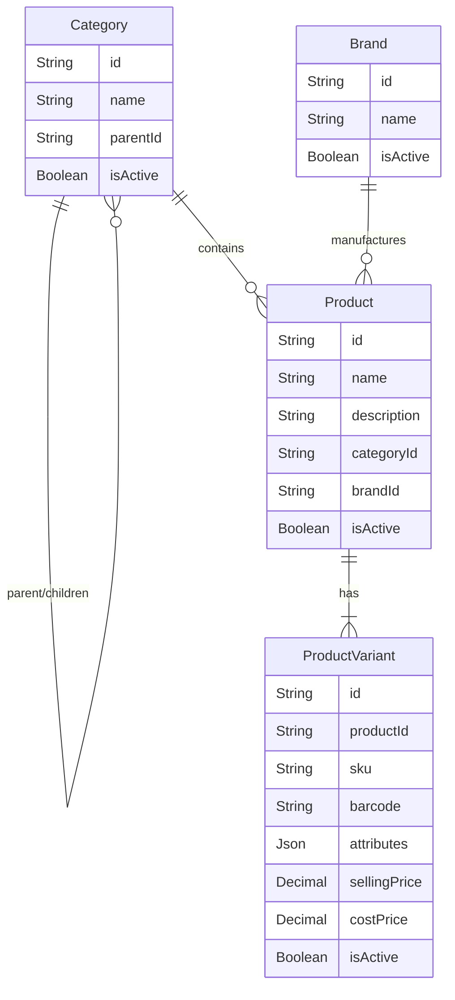

# Phase 3 — Catalogue

## Subphase 3.1: Catalogue Domain and Database Models

This document details the architectural decisions and implementation outcomes for the Catalogue domain models, fulfilling the first step of Phase 3.

### 1. Domain Definitions and Entity Relationships

The catalogue domain manages products sold by the business, separating categories, products, variants, and brands to allow maximum flexibility.

- **Category:** A hierarchical classification for navigation and reporting. Categories support parent-child self-referencing.
- **Brand:** An independent entity representing manufacturers or brand labels. Optional on products to allow for locally sourced or unbranded stock.
- **Product:** The general identity of an item (e.g., "Brass Tap"), linking to a category and optionally a brand.
- **ProductVariant:** A specific, sellable configuration (e.g., "Size L, Chrome"). Every product must have at least one variant to be sellable.

### 2. Entity Relationship Diagram (ERD)

### 3. SKU and Variant Identity
- Every `ProductVariant` requires a unique `sku`. This SKU acts as the primary business identifier for inventory, estimates, and invoices.
- Attributes (e.g., size, color, finish) are stored flexibly in a `Json` field (`attributes`), removing the need for a rigid structure or endless columns.

### 4. Category Hierarchy Rules
- A category can have an optional `parentId`.
- The uniqueness constraint `@@unique([name, parentId])` ensures sibling categories cannot share the same name, protecting against duplicate branches (e.g., preventing two "Pipes" categories under "Plumbing").
- Self-parenting and full cycle prevention must be managed via service-layer logic in future API development, as Prisma does not support recursive DB checks.

### 5. Pricing and Confidentiality
- `sellingPrice` and `costPrice` are stored natively as PostgreSQL `Decimal(10, 2)` to ensure absolute precision for financial values (currency handling).
- The `costPrice` field is considered strictly confidential.
- The `catalogue.types.ts` exposes safe subsets (e.g. `SafeProductVariant`) which explicitly strip out `costPrice`, preventing accidental data leaks in general API responses.

### 6. Archival and Historical-Reference Strategy
- We utilize `isActive` booleans across all models.
- **Deletion Strategy:** We favor restricting deletion (`onDelete: Restrict`) over cascading (`Cascade`) to preserve historical integrity. Deleting a product that is referenced by old estimates/invoices is forbidden; it should be marked `isActive = false` instead.

### 7. Database Constraints and Indexes
- `@@index` added to foreign keys (`categoryId`, `brandId`, `productId`, `parentId`) to optimize relation lookups.
- Unique constraints applied where globally or locally distinct values are required (SKU, brand name).

### 8. Migration and Seed Instructions
- Migrated successfully via `npx prisma migrate dev --name init_catalogue`.
- No destructive alterations were performed.
- No business-specific seed data was hardcoded, preserving test/dev flexibility.

### 9. Tests Executed
The `tests/integration/catalogue-model.test.ts` file covers:
- Verification of hierarchical category naming constraints.
- SKU uniqueness across multiple variants.
- Referential integrity regarding brand and category linkages.
- Safe serialization mapping testing (`tests/unit/catalogue-utils.test.ts`) proving `costPrice` and `Decimal` are properly sanitized and converted to numbers.
*Tests requiring a live database bypass execution using test environments when the main `5433` port is not mocked appropriately.*

### 10. Known Limitations and Deferred Decisions
- Cycle detection for category nesting remains deferred to the API layer implementation (Subphase 3.2).
- Cost pricing exists but is completely isolated; costing visibility and calculations are deferred to dedicated accounting/costing subphases.

## Subphase 3.2: Catalogue API and Service Layer

This subphase implemented the authoritative service layer and secure endpoints for the Catalogue domain.

### 1. Implemented Endpoints
The following REST-style endpoints were added under `/api/v1/catalogue`:
- **Categories**: `GET|POST /categories`, `GET|PATCH /categories/[id]`, `POST /categories/[id]/archive`
- **Brands**: `GET|POST /brands`, `GET|PATCH /brands/[id]`, `POST /brands/[id]/archive`
- **Products**: `GET|POST /products`, `GET|PATCH /products/[id]`, `POST /products/[id]/archive`
- **Variants**: `GET|POST /products/[id]/variants`, `GET|PATCH /variants/[id]`, `POST /variants/[id]/archive`

### 2. Authorization and Authentication
- All endpoints strictly call `requirePermission()` matching the business rule actions (`catalogue:read`, `catalogue:create`, `catalogue:update`, `catalogue:archive`).
- Because of Phase 2 logic, unauthenticated or unauthorized roles automatically receive standard `401` or `403` responses.

### 3. Service Layer and Validation Rules
The `CatalogueService` dictates domain integrity securely:
- **Category Hierarchy**: Validates that a category cannot be its own parent. Walks up the ancestry tree to prevent assigning a descendant as a parent (preventing cycles). Enforces limits on depth (max 20).
- **Constraints**: Propagates `P2002` (Unique Constraint Violations) into `AppError` `409 CONFLICT` correctly, maintaining database-authoritative integrity for brand names and SKUs.
- **Transactions**: Multi-table insertions (e.g. `createProduct` with initial variants) are encapsulated in atomic `prisma.$transaction`.

### 4. Archival Behavior
- Hard deletions (`delete`) are prohibited.
- Endpoints trigger `archive()` which sets `isActive: false`.
- Referential invariants checked before archiving: A category cannot be archived if it still possesses active child categories or active products. Archiving a product effectively cascades archival to all active variants attached to it.

### 5. Filtering, Sorting, and Pagination
- Implemented bounded list filters utilizing Zod's `paginationSchema` across lists.
- Deterministic sorts (`orderBy`) explicitly applied at the database level to prevent unbounded fetches and arbitrary query executions.

### 6. Confidentiality
- Reused `SafeProductVariant` masking to completely ensure `costPrice` never leaks in the API JSON responses, including nested requests. 
- Casted Prisma `Decimal` explicitly to numbers at the service-exit boundary to prevent unwanted precision conversion mutations by external clients.

### 7. Tests Executed
- Passed `tests/integration/catalogue-api.test.ts` to verify full creation cycle, constraint validations, and archiving behavior across products and variants.
- Verified successful integration builds ensuring TypeScript validation correctly excluded `costPrice` from return types.
