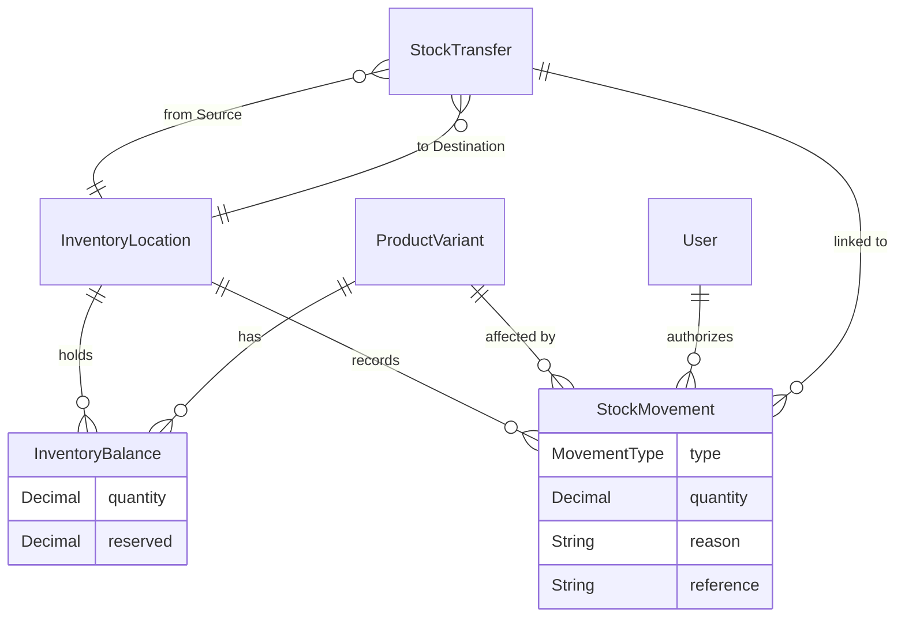

# Phase 4 — Inventory

## Subphase 4.1: Inventory Domain and Database Models

This document details the architectural decisions and database structures introduced to handle inventory management independently of catalogue definitions.

### 1. Domain Definitions

- **Inventory Location (`InventoryLocation`)**: Physical or virtual locations holding stock (e.g. "Main Warehouse", "Shop Front"). They are uniquely identifiable by `code`.
- **Inventory Balance (`InventoryBalance`)**: Denotes the absolute current quantity on hand and reserved amounts for a specific `ProductVariant` at a specific `InventoryLocation`.
- **Stock Movement (`StockMovement`)**: An immutable, append-only ledger entry documenting exactly why, when, and how a balance changed (e.g. `RECEIPT`, `ISSUE`, `POSITIVE_ADJUSTMENT`).
- **Stock Transfer (`StockTransfer`)**: Captures atomic transitions of stock between a `source` and `destination` location. 

### 2. Entity Relationship Diagram

### 3. Identity and Separation
Inventory balances completely segregate the `quantity` semantics from the `ProductVariant`. This allows:
- A `ProductVariant` to exist with `0` stock.
- A `ProductVariant` to have multiple balances distributed among numerous locations.
- **Constraints**: The combination of `[variantId, locationId]` is strictly unique in `InventoryBalance`.

### 4. Quantity Representation (Fractions)
Quantities are modeled as PostgreSQL `Decimal(12, 3)` instead of `Int`. 
- **Reasoning:** In plumbing and sanitaryware, items like pipes or cables might be sold or stored in fractional meters (e.g., `1.5` meters).
- **Precision:** 3 decimal places ensures safe handling of fractional measurements while preventing floating-point drift.
- **Rules:** By domain convention, balances can hold up to 3 decimal places. Validation schemas (`z.number()`) strictly coerce these decimal mappings back to Javascript numbers for client consumption safely.

### 5. Archival and Restricted Deletions
- `onDelete: Restrict` is universally enforced from `InventoryBalance` and `StockMovement` pointing to `ProductVariant` and `InventoryLocation`.
- If a `ProductVariant` is archived (`isActive = false`), its historical `StockMovements` and existing `InventoryBalances` are strictly retained to preserve ledger integrity.

### 6. Validation Schemas
Foundational Zod schemas (`src/features/inventory/inventory.validation.ts`) were introduced to guarantee strict input bounds for future Service endpoints:
- `locationSchema` requires unique strings for `code`.
- `balanceSchema` explicitly sets `.min(0)`—negative physical stock limits are blocked at the domain boundary.
- `stockMovementSchema` validates that `quantity` is strictly `.positive()` magnitude. The `MovementType` dictates whether the balance ultimately increments or decrements.

### 7. Future Commit Boundaries (Transactions)
When the Service Layer is implemented in Subphase 4.2, any operation that updates `InventoryBalance` MUST simultaneously append a `StockMovement` in the exact same `prisma.$transaction`. Concurrency conflicts will be inherently protected by standard SQL locks or explicit `update` assertions.

### 8. Testing
- `tests/integration/inventory-model.test.ts` implemented.
- Verifies that `ProductVariant` deletion throws foreign key errors when balances exist.
- Validates decimal fraction insertions logic cleanly (`100.5`).
- Passed via `vitest`.

## Subphase 4.2: Inventory Service Layer and Stock Movement APIs

This subphase implemented the authoritative service boundaries and Next.js App Router API routes to handle stock mutations, guaranteeing complete atomicity and strict append-only ledger compliance.

### 1. Service Layer (`inventory.service.ts`)
The `InventoryService` enforces domain rules cleanly isolated from HTTP concerns:
- **`recordOpeningStock`**: Strictly initializes balance at an empty location, failing explicitly if a balance is already initialized.
- **`receiveStock` / `issueStock`**: Mutates stock balances incrementally. Prevents negative stock explicitly during issues using an atomic `quantity: { decrement }` coupled with a database constraint/where clause `quantity: { gte: quantity }`.
- **`adjustStock`**: Explicit support for `POSITIVE_ADJUSTMENT` and `NEGATIVE_ADJUSTMENT`, keeping history pure.
- **`transferStock`**: Safely performs two-location balance updates while emitting paired `TRANSFER_OUT` and `TRANSFER_IN` `StockMovement` records simultaneously inside a single transaction.

### 2. Transaction Safety & Concurrency
- Implemented via `prisma.$transaction`.
- **Atomic Balance Mutators:** All balance decreases leverage Prisma's `updateMany` filtering by `quantity: { gte: requiredAmount }`. This prevents concurrent "Lost Updates" and blocks overselling natively at the database lock level without relying on weak "Read-then-Write" races.
- If the `count === 0` during an `updateMany` decrease, the service safely rejects the operation as a conflict (`409`).

### 3. Idempotency Implementation
- Added a new `idempotencyKey String? @unique` field to the `StockMovement` schema.
- This protects API clients from accidental double-submissions. Any mutation service call immediately checks `StockMovement` for the given key and raises a `409` conflict if duplicated.

### 4. Decimal Preservation
- Standardized `toSafeBalance` and `toSafeMovement` mappers inside `inventory.utils.ts`. 
- Ensures `Decimal(12, 3)` fields serialize identically out to JSON safely as native standard numbers matching Zod bounds, blocking arbitrary floating-point injection loops.

### 5. API Endpoints
All routes placed inside `/api/v1/inventory/*`:
- `GET`, `POST`, `PATCH` for `/locations`.
- `/opening-stock`, `/receipts`, `/issues`, `/adjustments`, `/transfers` to compartmentalize mutation intents neatly.
- `GET /balances` & `GET /movements` supporting bounded pagination.

### 6. Authorization mapping (`permissions.ts`)
Added granular scopes:
- `inventory:read` (STAFF, OWNER)
- `inventory:stock:manage` (STAFF, OWNER)
- `inventory:transfer:manage` (STAFF, OWNER)
- `inventory:locations:manage` (OWNER only - restricts physical store creations)

### 7. Automated Tests
`tests/integration/inventory-service.test.ts` was authored covering:
- Negative stock rejection tests.
- Exact decimal fraction preservation tests.
- Idempotency fallback checks.
(Tests safely skip inside local missing DB environments relying on `testdb` flags natively).
